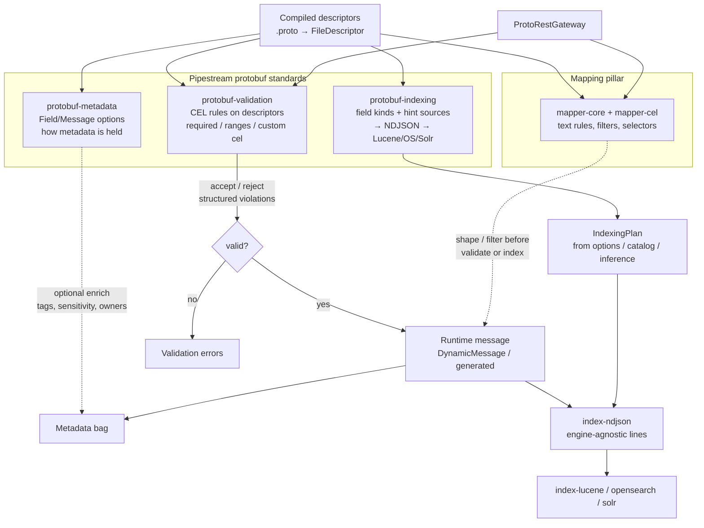

# Pipestream Proto Tools

Public JVM toolkit for protobuf: **CEL-driven field mapping**, descriptor catalogs,
schema-registry loaders, metadata extraction, search-index projection, and
**JSON/REST + OpenAPI** over any descriptor source.
JDK **25**, virtual threads for parallel CEL warmup / metadata extraction.

No coupling to any particular message type — bind any protobuf message (or `Struct`)
into CEL as `input`.

## Requirements

- JDK 25
- Gradle 9.6+ (wrapper included)

## Repository layout

Modules are grouped by domain (Maven artifact IDs unchanged):

```text
core/           descriptors, helpers
mapper/         core, cel, metadata (CEL extractor)
protobuf/       metadata, validation, indexing standards
schema/         apicurio, confluent
index/          spi, ndjson, lucene, opensearch, solr
http/           json, rest, openapi
integrations/   spring + quarkus DI wiring (not HTTP hosts)
servers/        HTTP hosts (jdk, vertx, netty, spring, micronaut, quarkus)
samples/
```

`integrations/spring` wires beans; `servers/spring` is the MVC host. Same split as Quarkus.

## Modules

| Artifact | Path | Role |
|---|---|---|
| `pipestream-proto-tools-bom` | `bom/` | Version alignment |
| `…-descriptors` | `core/descriptors` | `DescriptorRegistry` / loaders (classpath, `.dsc`) |
| `…-helpers` | `core/helpers` | `AnyHandler`, `TypeConverter`, `MappingHelper`, `MessageDiff` |
| `…-mapper-core` | `mapper/core` | Text rules (`target = source`, `+=`, `-field`) + path I/O |
| `…-mapper-cel` | `mapper/cel` | CEL env, evaluator, filter/selector mapper |
| `…-metadata` | `mapper/metadata` | CEL selectors → metadata bag (runtime extraction) |
| `…-protobuf-metadata` | `protobuf/metadata` | **Metadata standard** — Field/Message options |
| `…-protobuf-validation` | `protobuf/validation` | **Validation standard** — CEL + constraints, pluggable rule-source dialects |
| `…-protobuf-validation-buf` | `protobuf/validation-buf` | Optional protovalidate (`buf.validate`) dialect (vendored proto, pinned + attributed) |
| `…-protobuf-indexing` | `protobuf/indexing` | **Indexing standard** facade — optional validate → NDJSON |
| `…-schema-apicurio` | `schema/apicurio` | Apicurio Registry → descriptors |
| `…-schema-confluent` | `schema/confluent` | Confluent-compatible SR → descriptors (subjects REST API or binary descriptor sets) |
| `…-index-spi` | `index/spi` | Indexing plans + descriptor **indexing hints** + SPI |
| `…-index-ndjson` | `index/ndjson` | Message → **NDJSON** (engine-agnostic) |
| `…-index-lucene` | `index/lucene` | Lucene `Document` plugin |
| `…-index-opensearch` | `index/opensearch` | OpenSearch document-map plugin |
| `…-index-solr` | `index/solr` | Solr document-map plugin |
| `…-json` | `http/json` | Protobuf ↔ JSON transcoder |
| `…-rest` | `http/rest` | Framework-agnostic JSON/REST gateway |
| `…-openapi` | `http/openapi` | OpenAPI 3.x from registered REST methods |
| `…-jsonschema` | `http/jsonschema` | JSON Schema (2020-12) from descriptors + validation rules |
| `…-quarkus` / `…-spring` | `integrations/*` | Framework DI wiring (mappers / descriptors) |
| `…-server-*` | `servers/*` | HTTP hosts (JDK, Vert.x 5, Netty, Spring, Micronaut, Quarkus) |
| `samples` | `samples/` | Unpublished examples |

## Quick start

```groovy
dependencies {
    implementation platform('ai.pipestream:pipestream-proto-tools-bom:<version>')
    implementation 'ai.pipestream:pipestream-proto-tools-mapper-cel'
}
```

```java
var registry = DescriptorRegistry.create();
var mapper = new ProtoFieldMapperImpl(registry);

// Text rules (assign / append / clear)
mapper.mapInPlace(builder, List.of(
    "title = body",
    "tags += \"proto\"",
    "-scratch"
));

// CEL filter + selector
var cel = new CelEvaluator(CelEnvironmentFactory.builder()
    .addMessageType(builder.getDescriptorForType())
    .addVar("input")
    .build());
new CelProtoMapper(mapper, cel).map(builder, List.of(
    new CelMappingRule(
        "input.lang == 'en'",          // filter
        "input.title",                 // selector
        "search_title",                // target path
        List.of())                     // optional text-rule fallback
));
```

## Schema validation

```java
ProtoFqnConflictDetector.validateAndAssertNoConflicts(Map.of(
    "ref-a", fileDescriptorProtoA,
    "ref-b", fileDescriptorProtoB));
BinaryProtobufIdentifierValidator.validate("upload", fileDescriptorProto);
```

Rejects illegal binary identifiers and cross-file FQN wire-shape conflicts before
they reach a registry.

## Apicurio parse fallback

When the registry is down but you know the concrete type, strip the Apicurio
wire prefix and `parseFrom` directly:

```java
Struct msg = ApicurioProtobufParseFallback.forType(Struct.class).parse(wireBytes);
```

For Kafka consumers on Apicurio serde, prefer the serde's own config flag when available.

## Apicurio descriptors

```groovy
implementation 'ai.pipestream:pipestream-proto-tools-schema-apicurio'
```

Plain Java:

```java
var loader = ApicurioDescriptorLoader.builder()
    .registryUrl("http://localhost:8080/apis/registry/v3")
    .groupId("default")
    .registryClient(client)
    .build();
registry.addLoader(loader);
```

Quarkus (`pipestream.proto.apicurio.*`):

```properties
pipestream.proto.apicurio.enabled=true
pipestream.proto.apicurio.registry-url=http://localhost:8080/apis/registry/v3
pipestream.proto.apicurio.group-id=default
pipestream.proto.apicurio.auto-load-on-startup=false
```

## Free REST over any schema registry

JSON in/out for protobuf RPCs, with descriptors resolved through Apicurio or
Confluent-compatible loaders (plugins), plus OpenAPI 3 from the same registry.

```java
var descriptors = DescriptorRegistry.create();
// descriptors.addLoader(apicurioLoader); // or Confluent loader plugin

var methods = new ProtoRestMethodRegistry();
methods.register(ProtoRestMethod.builder("Greeter", "SayHello", req -> /* invoke */ resp)
    .requestType(HelloRequest.class)
    .apiToken(ApiTokenRequirement.apiKeyHeader("api_token"))
    .summary("Say hello")
    .build());

var gateway = new ProtoRestGateway(
    methods,
    new ProtobufJsonTranscoder(descriptors),
    ProtoApiTokenValidator.sharedSecret(System.getenv("API_TOKEN")));

String json = gateway.invoke("Greeter", "SayHello", "{\"name\":\"Ada\"}",
    Map.of("api_token", token), Map.of());

String openApi = new ProtoOpenApiGenerator().generateJson(methods);
```

Annotations for framework glue / codegen:

- `@ProtoRestExposed` — mark **methods** for REST exposure (path, HTTP verbs, summary); type-level supplies defaults
- `@ProtoApiToken` — declare API-token security (header/query, apiKey or HTTP bearer)
- `ProtoRestAnnotationRegistrar` — scan beans and register onto `ProtoRestMethodRegistry`

```java
new ProtoRestAnnotationRegistrar(methods).register(new EchoService());
```

Quarkus/Spring produce `ProtoRestGateway` / transcoder beans; start `ProtoToolsServer` yourself (or use Vert.x later).

### Server hosts (`servers/*`)

Same {@code ProtoRestGateway} surface; pick a host artifact:

| Artifact | Notes |
|---|---|
| `…-server-jdk` | Default — JDK {@code HttpServer}, zero HTTP deps |
| `…-server-vertx` | **Vert.x 5** (Quarkus 3.x is still Vert.x 4) |
| `…-server-netty` | Scaffold — full Netty pipeline next |
| `…-server-spring` / `…-micronaut` / `…-server-quarkus` | Framework adapters |

```java
var server = new JdkProtoRestServer(config, gateway); // or VertxProtoRestServer
server.start();
// POST /grpc-json/{service}/{method}
// GET  /openapi.json
// GET  /health
```

Sample:

```shell
./gradlew :samples:runJsonRestServer
curl -H 'api_token: secret' -H 'content-type: application/json' \
  -d '{"name":"Ada"}' http://127.0.0.1:8080/grpc-json/Echo/echo
```

## Protobuf standards (metadata · validation · indexing)

Three independent descriptor standards — the same `FieldOptions` / `MessageOptions`
mechanism protovalidate uses, with CEL where it matters. Consume any
subset; chain validate → index only when you want to.

| Standard | Artifact | Option namespace | Role |
|---|---|---|---|
| Metadata | `…-protobuf-metadata` | `(ai.pipestream.proto.meta.v1.field\|message)` | How descriptive/ops metadata is held on schemas |
| Validation | `…-protobuf-validation` | `(ai.pipestream.proto.validate.v1.field\|message)` + any `ValidationRuleSource` dialect | CEL + standard constraints, neutral rule model |
| Indexing | `…-index-spi` (+ `…-protobuf-indexing`) | `(ai.pipestream.proto.index.hints.v1.index)` | Field kinds → plan → NDJSON → Lucene/OS/Solr |

Mapping (`mapper-core` / `mapper-cel`) stays a fourth pillar — reshaping messages
is its own concern, not folded into validation.



### Metadata

```protobuf
import "ai/pipestream/proto/meta/v1/metadata.proto";

message Doc {
  option (ai.pipestream.proto.meta.v1.message) = {
    owner: "search-platform"
    sensitivity: "internal"
  };
  string doc_id = 1 [(ai.pipestream.proto.meta.v1.field) = {
    description: "Stable id"
    sensitivity: "public"
  }];
}
```

```java
DescriptorMetadata.registerExtensions(extensionRegistry);
Map<String, Object> bag = DescriptorMetadata.asBag(Doc.getDescriptor());
```

### Validation (CEL-first)

```protobuf
import "ai/pipestream/proto/validate/v1/validate.proto";

message Person {
  string name = 1 [(ai.pipestream.proto.validate.v1.field) = {
    required: true
    string: { min_len: 2 }
  }];
  string email = 2 [(ai.pipestream.proto.validate.v1.field) = {
    cel: { id: "email.not_localhost"
           expression: "!this.endsWith('@localhost')" }
  }];
}
```

```java
var result = ProtoValidator.forMessageType(Person.getDescriptor()).validate(person);
result.throwIfInvalid();
```

#### Rule surface

| Category | Rules |
|---|---|
| any field | `required`, `cel` (custom CEL with `this`) |
| `string` | `const`, `len`, `min_len`, `max_len` (code points), `pattern`, `prefix`, `suffix`, `contains`, `not_contains`, `in`, `not_in`, `email`, `uuid`, `hostname`, `uri`, `ip`, `ipv4`, `ipv6` |
| `int32` / `int64` (+ `sint*`, `sfixed*`) | `const`, `gt`, `gte`, `lt`, `lte`, `in`, `not_in` |
| `uint32` / `uint64` (+ `fixed*`) | same, with unsigned comparison semantics |
| `double` / `float` | `const`, `gt`, `gte`, `lt`, `lte`, `in`, `not_in`, `finite` |
| `bool` | `const` |
| `bytes` | `len`, `min_len`, `max_len`, `prefix`, `suffix`, `contains` |
| `enum` | `const`, `defined_only`, `in`, `not_in` |
| `repeated` | `min_items`, `max_items`, `unique`, `items` (nested `FieldRules` per element) |
| `map` | `min_pairs`, `max_pairs`, `keys` / `values` (nested `FieldRules` per entry) |
| `google.protobuf.Timestamp` | `gt`, `gte`, `lt`, `lte`, `lt_now`, `gt_now`, `within` |
| `google.protobuf.Duration` | `gt`, `gte`, `lt`, `lte` |

Violation rule ids are stable and deliberately align with protovalidate's naming
(`string.min_len`, `repeated.unique`, `timestamp.within`, …), so results interoperate
across annotation dialects. Paths use `[i]` for repeated elements, `["key"]` for map entries,
and a `#key` suffix when the map key itself violates. Standard rules run only when the
field is present (proto3 semantics); repeated/map size rules also apply to empty
collections. Message-typed elements — including repeated elements and map values — are
validated recursively.

#### Rule sources (extension seam)

`ProtoValidator` does not read any specific annotation dialect directly. It evaluates a
neutral constraint model (`ai.pipestream.proto.validate.model` — `FieldConstraints` plus
per-category records: string, integral, floating, bool, bytes, enum, repeated, map,
timestamp, duration, CEL, and `MessageConstraints`). Each annotation dialect is a
`ValidationRuleSource` that reads its
own options off the descriptor and translates them into that model. The built-in
`AiPipestreamRuleSource` reads the Pipestream `validate.v1` options.

```java
public interface ValidationRuleSource {
    Optional<FieldConstraints>   fieldConstraints(FieldDescriptor field);
    Optional<MessageConstraints> messageConstraints(Descriptor message);
}
```

Every configured source is consulted per field/message and all violations are **merged** —
no source silently wins. The default chain is the built-in reader plus any
`ValidationRuleSource` discovered on the classpath via `ServiceLoader`
(`ValidationRuleSources.defaults()`), so an optional dialect module lights up just by being
present and is removed cleanly by dropping it. Pin the chain explicitly when you want to:

```java
// built-in only, ignore classpath extensions
ProtoValidator.forMessageType(desc, ValidationRuleSources.pipestreamOnly());
// explicit multi-dialect chain
ProtoValidator.forMessageType(desc, List.of(new AiPipestreamRuleSource(), new BufValidateRuleSource()));
```

**Protovalidate interop** ships as the optional `…-protobuf-validation-buf` module: it
vendors `buf/validate/validate.proto` (pinned at v1.2.2, Apache-2.0 attributed in its
`NOTICE`) and provides `BufValidateRuleSource`, so schemas annotated with
`(buf.validate.field)` / `(buf.validate.message)` validate through `ProtoValidator`
unchanged — dropping the jar on the classpath is enough. All scalar and collection
rule families translate, including every integer variant with unsigned semantics and
`IGNORE_ALWAYS`; the Javadoc lists the not-yet-translated tail (byte-length string
rules, exotic well-known formats, `Any`/`FieldMask` rules, predefined-rule extensions,
protovalidate's custom CEL function library). Compatibility will be measured and
published against the protovalidate conformance suite rather than claimed.

#### JSON Schema from descriptors + rules

`…-jsonschema` renders any message type as JSON Schema (draft 2020-12) describing its
canonical proto3 JSON form — and because it consumes the same neutral constraint model
the validator evaluates, every mappable rule lands as a real JSON Schema keyword:
`min_len`→`minLength`, bounds→`minimum`/`exclusiveMaximum`, `in`→`enum`,
`min_items`/`unique`→`minItems`/`uniqueItems`, map `keys`→`propertyNames`, and the
string formats (`email`, `uuid`, `hostname`, `uri`, `ipv4`, `ipv6`) map to their
`format` equivalents. Works for any `ValidationRuleSource` dialect. CEL rules (not
expressible in JSON Schema) are surfaced under `x-pipestream-cel`.

```java
Map<String, Object> schema = ProtoJsonSchemaGenerator.create().generate(Person.getDescriptor());
String json = ProtoJsonSchemaGenerator.create().generateJson(Person.getDescriptor());
```

Message types are defined once under `$defs` (recursion-safe `$ref`s); 64-bit integers
accept both JSON number and string forms per proto3 JSON; enums accept declared names
or numbers. Not mapped (by design, documented in the Javadoc): bytes length rules and
timestamp/duration bounds.

### Indexing (+ optional validate chain)

```java
var indexer = ProtobufIndexer.defaults(
    ProtoValidator.forMessageType(doc.getDescriptorForType()));
indexer.plan(doc.getDescriptorForType());   // hints / catalog / inference
indexer.toNdjsonLine(doc);                  // validates first when configured
```

## Indexing (hints + NDJSON + engine plugins)

Indexing hints use protobuf `FieldOptions` extensions that bake into the descriptor —
plain `protoc` / protobuf-gradle-plugin is all the codegen you need. The
`.proto` ships inside `pipestream-proto-tools-index-spi` (`index/spi`, also on the
classpath as a resource). Use `…-protobuf-indexing` for the validate → NDJSON facade.

| Concern | Option | Tooling |
|---|---|---|
| Metadata | `(ai.pipestream.proto.meta.v1.field)` | `…-protobuf-metadata` |
| Validation | `(ai.pipestream.proto.validate.v1.field)` | `…-protobuf-validation` (CEL-first) |
| Indexing | `(ai.pipestream.proto.index.hints.v1.index)` | `…-index-spi` + engine plugins |

NDJSON does not interpret hints — only engine plugins do.

```protobuf
import "ai/pipestream/proto/index/hints/v1/indexing_hints.proto";

message Doc {
  string doc_id = 1 [(ai.pipestream.proto.index.hints.v1.index) = { type: INDEX_FIELD_TYPE_KEYWORD }];
  string title  = 2 [(ai.pipestream.proto.index.hints.v1.index) = { type: INDEX_FIELD_TYPE_TEXT }];
}
```

Gradle (no Buf): depend on the SPI artifact and add its proto root to `protoc`, or
copy `indexing_hints.proto` from the jar. Register extensions when loading descriptors:

```java
ExtensionRegistry registry = ExtensionRegistry.newInstance();
ProtoOptionsIndexingHintSource.registerExtensions(registry);
// parse FileDescriptorSet / build FileDescriptor with that registry

var plan = IndexingPlanFactory.defaults(new CatalogIndexingHintSource()).create(desc);
var engines = SearchEngineIndexers.createAll(new IndexerContext(fieldMapper));
engines.get("lucene").map(message, plan);
engines.get("opensearch").map(message, plan);

new ProtoNdjsonWriter().writeBulkIndex(bulk, "docs", id, message);
```

## Proto linting

All Pipestream standard `.proto` files (and their test fixtures) are linted with
`buf lint` (**STANDARD** rules) to keep style consistent with the wider protobuf
ecosystem. Codegen stays plain `protoc` / protobuf-gradle-plugin.

```shell
buf lint          # or: ./gradlew bufLint / check
```

Configured in [`buf.yaml`](buf.yaml) (paths under `protobuf/` and `index/spi`).
Packages are version-suffixed (`…v1`) and enums use Buf-style prefixes
(`INDEX_FIELD_TYPE_*`).

## Integration tests

The schema-registry loader modules ship integration tests (JUnit `@Tag("integration")`)
that run against real registries:

```shell
docker compose -f docker-compose.integration.yml up -d

./gradlew :pipestream-proto-tools-schema-apicurio:test \
          :pipestream-proto-tools-schema-confluent:test
```

They cover Apicurio Registry's native v3 API (`ApicurioDescriptorLoader`) and the
Confluent subjects API (`ConfluentSchemaRegistryLoader`, including schema
references and well-known imports) against **both** Apicurio's ccompat facade and
a real Confluent Schema Registry. When a registry is not reachable (quick ~2s probe) the
tests **skip** via JUnit assumptions, so a plain `./gradlew build` stays green
without containers. Test artifacts/subjects use unique per-run names, so reruns
against a long-lived registry never collide.

Default endpoints match `docker-compose.integration.yml`; override with system
properties (or the matching environment variables):

| Property | Env variable | Default |
|---|---|---|
| `pipestream.it.apicurio.url` | `PIPESTREAM_IT_APICURIO_URL` | `http://localhost:18780` |
| `pipestream.it.confluent.url` | `PIPESTREAM_IT_CONFLUENT_URL` | `http://localhost:18781` |

```shell
./gradlew :pipestream-proto-tools-schema-apicurio:test \
          -Dpipestream.it.apicurio.url=http://my-registry:8080
```

The `schema/confluent` module ships two loaders: `ConfluentSchemaRegistryLoader`
speaks the Confluent Schema Registry subjects REST protocol — it lists subjects,
fetches PROTOBUF schema *text* plus schema references (`{name, subject, version}`,
resolved recursively with cycle protection; dangling references skip just that
subject), and compiles everything to runtime `FileDescriptor`s via Square Wire —
while `ConfluentDescriptorSource` remains the binary path, consuming compiled
`FileDescriptorSet` payloads over plain HTTP or from the classpath.

Known limitations documented by the tests: `ApicurioDescriptorLoader` does not yet
resolve registry artifact references (protos importing other registered protos are
skipped gracefully).

## Building

```shell
./gradlew build
./gradlew publishToMavenLocal
```

Versions come from Axion (`v*` tags) or `-PpublishVersion=…`. Signing runs only when
`GPG_PRIVATE_KEY` is set.

## License

[MIT](LICENSE) © 2026 ai.pipestream
