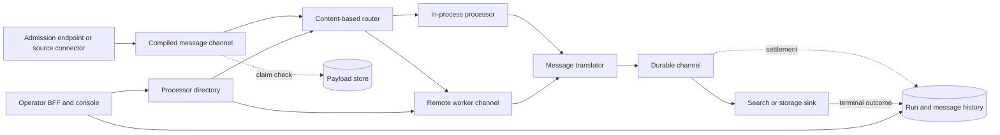

# Enterprise message processing gap analysis

Status: product planning source, refreshed after implementation inspection on
2026-09-04. The original comparison is against Forgejo `main`; the directory,
worker-control, channel, claim-check, dead-letter, and recovery behavior below
is implemented and locally verified on `descriptor-flow-runtime`. It is not
presented here as merged or released.

This document answers a narrow product question: which useful capabilities in
the reference integration platform are not yet available as real ProtoMolt
behavior, and how should ProtoMolt land equivalent or stronger behavior without
adopting the reference platform's document model or product vocabulary?

The short answer is that ProtoMolt now has the descriptor-native core and its
first recovery-complete delivery stack: exact schema identity,
conformance-tested projection, compiled directed flows, one local/remote
processor seam, a watchable and fenced processor directory, capacity-aware
workers, declared channels, protobuf WAL and transactional outbox storage,
digest-verified claim checks, typed retry and dead-letter records, restart-safe
descendant settlement, and one replay executor shared by history and recovery
RPCs. The largest remaining product gaps are operational source connectors,
search materialization receipts and deletion, a second transport conformance
target, and the operator application.

ProtoMolt should preserve its stronger descriptor-native model. An application
payload is any real protobuf message. A small transport envelope carries
delivery and schema identity; it does not become a canonical business-document
type. Mapping and projection are compiled between the actual source and target
descriptors. This is both more general and easier to govern than copying a
fixed, multipart document envelope.

## Scope, evidence, and truth rules

The reference implementation is the multi-repository checkout under
`/work/main/pipestream-ai`. The user-facing target is ProtoMolt at
`/work/main/dev-tools/protomolt`.

The reference repositories were inspected at their local heads, dated between
2026-08-01 and 2026-08-16. The original ProtoMolt comparison used Forgejo
`origin/main` at `3410aeef0fb1df227887ff462ebd21f380a0782f`, dated 2026-09-03.
This refresh also inspected `descriptor-flow-runtime`, based on Forgejo and
GitHub `main` at `b65b7de3`. Its committed foundation is:

- `1ffb7cf1`: canonical descriptor identity and projection conformance;
- `b0f0a871`: compiled directed protobuf flows and unified history;
- `556a053b`: demand-driven remote execution, protobuf WAL, and settlement; and
- `87f5b12d`: the new runtime module's BOM constraint;
- `9279bf4a`: immutable publication, revision-fenced deployments, durable runs,
  persistent protobuf history and frontiers, cancellation, replay, and the
  lifecycle gRPC service.

The current branch increment adds the cluster-backed directory and worker
control plane plus the declared channel, claim-check, dead-letter, and recovery
stack described in this document. Current code and tests are the identity of
that increment; this planning document deliberately does not embed a mutable
working-tree hash.

The branch has focused coverage for lifecycle, restart, cancellation, replay,
WAL, PostgreSQL outbox, payload retention, directory watch/resync, worker
control, and in-process gRPC behavior. The final full-build count belongs in
the landing evidence rather than this long-lived design file. Because the
branch is local, this document distinguishes implemented branch behavior from
behavior merged to `main`.

This is an implementation inventory, not a README parity exercise:

- Code and tests outrank prose.
- A protobuf or Java interface without a mounted runtime is not a product
  capability.
- Several useful classes that could be connected are marked **Composable**, not
  **Available**.
- Design-only features are not reported as implemented.
- Build conventions, dependency versions, and branding are not product gaps.
- Search-engine internals owned by `protomolt-search` are not duplicated into
  the Java platform. The gap is the integration and administration seam.
- The standards-track QUIC material in the reference checkout is a draft and
  algorithm guide. It is not a runtime reference implementation.

The prior August search-only comparison remains useful history, but it predates
the current ProtoMolt search and mesh work and does not answer this broader
platform question. This document supersedes it for product planning.

## Status vocabulary

| Status | Meaning |
|---|---|
| **Available** | Mounted product behavior exists and has meaningful tests. |
| **Implemented on branch** | Real, tested behavior exists on `descriptor-flow-runtime`, but is not yet claimed as merged or released. |
| **Composable** | The required primitives exist, but no supported execution path assembles them. |
| **Partial** | A narrower or non-durable version is mounted. |
| **Missing** | No equivalent implementation was found. |
| **Do not copy** | The source behavior is real, but its shape would weaken ProtoMolt's model. |

## Product vocabulary

ProtoMolt should use its existing vocabulary plus established enterprise
integration pattern names. Reference repository names may appear in the source
ledger, but they are not proposed product nouns.

| Product concept | ProtoMolt and industry term |
|---|---|
| Authored processing graph | workflow or integration flow |
| One execution | run |
| Executable step | processor or message endpoint |
| Connection between processors | message channel |
| Conditional branch | content-based router |
| Conditional discard | message filter |
| One input to many outputs | splitter or recipient list |
| Many correlated inputs to one output | aggregator |
| Shape conversion | message translator, mapping, or projection |
| Large payload externalization | claim check |
| Duplicate-safe consumer | idempotent receiver |
| Failed-message destination | dead-letter channel |
| Execution journal | message history |
| Copy of an execution event | wire tap |
| Runtime management stream | control bus |
| Discoverable executable | processor advertisement |
| Work shared by equivalent consumers | competing consumers |
| Stable flow revision | workflow version |
| Selected live revision | deployment pointer |

`workflow`, `run`, `pipeline`, `processor`, `instruction`, `mapping`,
`chunking policy`, `service`, `role`, and `gate` remain the canonical ProtoMolt
terms. New APIs must not reintroduce retired project terms.

## What ProtoMolt already does as well or better

The correct plan starts by retaining these strengths rather than wrapping them
in a second platform:

| Capability | Current state |
|---|---|
| Arbitrary protobuf messages | **Available.** Core operations use descriptors and `DynamicMessage`; generated classes are optional. |
| Descriptor acquisition and compilation | **Available.** Filesystem, jar, Git, and Maven sources feed descriptor hygiene, source compilation, and compatibility checks. |
| Registry support | **Available.** Git-backed storage plus Confluent and Apicurio clients are present. Federation is intentionally narrow. |
| Path and CEL mapping | **Available.** The core mapper and the single CEL implementation support typed path operations, filters, selectors, and progressive writes. |
| Descriptor-declared projections | **Implemented on branch without the former map gap.** A target message declares its sources and field provenance; projection now covers typed maps, oneof conflict detection, cross-pool `Any` and enum handling, recursive messages, well-known types, and exact numeric narrowing without generated classes or JSON conversion. |
| Joins and synthesized shapes | **Available.** Joins, unions, merges, and derived real protobuf types exist independently of the search backend. |
| Validation and quality primitives | **Available.** ProtoMolt includes protovalidate conformance, rule dialects, metadata, validation, and descriptor-driven quality scoring. |
| RPC composition checks | **Available.** Pipeline checking understands unary and all streaming cardinalities, fan-out, collection, unnesting, and structured generation. |
| Workflow evidence | **Available.** Serial gRPC workflows support gates, deadlines, records, replay, and drift checks. |
| Delegated work | **Available.** Bidirectional worker delegation includes leases, checkpoints, evidence, and resumable agent hosts. |
| Product surfaces | **Available.** The same action catalog reaches gRPC/reflection, REST, OpenAPI, Swagger, MCP, ACP, CLI, and browser consoles. |
| Provider-oriented search and sinks | **Available.** Search mappings, Lucene/OpenSearch/Solr/Qdrant-oriented components, embedding providers, Kafka, S3, Parquet, Iceberg, and bundle sinks already exist. |
| Signed work evidence and authorization model | **Available or stronger.** Signed records and a closed scope vocabulary provide a better governance base than service-boundary trust. |
| Role-based deployment | **Available.** One distribution can mount selected roles and use local or remote role targets. |

The gap is not “add protobuf support.” The gap is turning these parts into one
reliable message-processing product.

### Reviewed capabilities that are not product gaps

The remaining source repositories and support features do not justify target
features of their own:

- A central protobuf build, descriptor snapshot, and source archive solve
  distribution for many independent repositories. ProtoMolt already builds its
  descriptors and contracts in one multi-project repository.
- A dependency platform, framework extensions, and shared Gradle conventions
  are source-build organization. ProtoMolt already has a unified Gradle build,
  framework integrations, test fixtures, and one dependency graph. Useful test
  support should be extracted when the runtime lands, not copied as a product.
- A generated test-data utility and an echo processor are fixture and SDK
  examples. Their product value is captured by the proposed conformance lab and
  reference worker.
- Module-owned UI proxy channels are an extension technique, not a required
  architecture. Prefer stable task-shaped BFF contracts and descriptor-driven
  views; add a sandboxed extension surface only when a processor needs a UI that
  those primitives cannot express.
- The source platform's repository split and release automation are not runtime
  semantics. ProtoMolt should stay one coherent build until an independently
  versioned contract or deployment boundary proves a split is necessary.

## Capability gaps

### 1. Flow authoring and execution

| Reference behavior | ProtoMolt state | ProtoMolt landing |
|---|---|---|
| Immutable directed flow versions, draft validation, an activation pointer, and in-flight version pinning | **Implemented on branch.** `DurableFlowCoordinator` validates and immutably publishes exact compiled plans, moves deployment pointers under revision fences, and pins every run to its accepted version, plan fingerprint, and deployment revision. | Mount the lifecycle service with the product role after directory-backed processor resolution is available; do not weaken immutable version identity. |
| Executable branching directed graph | **Implemented on branch for acyclic execution.** `FlowCompiler` resolves exact processor contracts, predicates and projections, rejects cycles and unreachable nodes, and fingerprints the resulting plan. `FlowRuntime` provides bounded branching and fan-out; `DurableFlowCoordinator` owns persisted execution. Aggregation remains open. | Add aggregation semantics after the durable channel and descendant-set model can represent their barriers exactly. |
| The same processor can run in-process or remotely | **Implemented on branch.** Local and demand-driven gRPC execution share `ProcessorInvoker`, typed payload validation, history, deadline, failure, and settlement seams. Product composition admits the remote endpoint only through the live exact-contract directory. | Retain local/remote conformance as the gate for every new outcome and transport. |
| Processors pull work on a long-lived bidirectional stream | **Implemented on branch.** Workers initiate one fenced stream, advertise exact contracts and leases, heartbeat, publish capacity, grant bounded demand, acknowledge cancellation, drain, and reconnect only within the admitted incarnation and grace. | Package the wire fixtures as a language-neutral conformance kit before adding another worker implementation. |
| Competing consumers scale from declared and observed capacity | **Implemented on branch.** Effective dispatch is the minimum of worker credit, node capacity, processor capacity, local queue pressure, and coordinator ceiling. Zero capacity and non-active health yield zero claims. | Add measured ramp and idle-retirement policies only when fleet evidence requires them. |
| Per-channel delivery mode selects memory or durable transport | **Implemented on branch.** Immutable `ChannelPolicy` selects bounded memory, local protobuf WAL, or transactional PostgreSQL state plus outbox. The adapters share one state-machine conformance fixture. | Add another external adapter only behind the same contract and fixtures. |
| Memory pressure can spill to an explicitly allowed durable channel | **Implemented on branch.** The bounded memory channel backpressures or uses only a compiled named durable spill target; undeclared spill and persistence-sensitive paths are refused. | Keep spill visible in the single run history and measure its crossover cost. |
| Downstream completion controls upstream acknowledgement | **Implemented on branch with restart-safe settlement frontiers.** Remote completion remains `COMPLETED`; the lifecycle WAL persists completed-but-unsettled descendants and edge-owned payload leases, recovery restores both, and a durable commit-boundary bit fences cancellation before reverse-order settlement starts. | Extend the same explicit terminal-set model when aggregation barriers land. |
| Deterministic child identities across fan-out and retry | **Implemented on branch.** Run, parent message, processor, and output ordinal derive stable message, invocation, and delivery identities across replay and at-least-once delivery. | Preserve these identities in every future channel, claim-check, dead-letter, and replay adapter. |
| Typed retryable, permanent, skipped, abandoned, and cancelled outcomes | **Implemented on branch.** One protobuf outcome carries structured causes, exact retry advice, attempt ceilings, jitter policy, and settlement effect across workers and channels. The old boolean is reserved. | Extend processors with compensation behavior only when a workflow declares it. Never infer retryability from free-form text. |
| Per-processor and global dead-letter channels | **Implemented on branch.** Compiled policy selects the dead-letter reference. Append-only records retain the original envelope or claim check, exact run and processor frontier, outcome, attempts, policy, retention state, and replay provenance. | Add operational indexing and authorization for multi-tenant recovery-center use. |
| Replay from a selected processor or downstream frontier | **Implemented on branch.** Selected history and dead-letter replay both delegate to `DurableFlowCoordinator.replay`, create a new durable run, and pin the source version, descriptors, plan fingerprint, deployment revision, payload, and frontier. Duplicate requests are byte-idempotent; identity drift is a named refusal. | Keep `DurableFlowCoordinator.replay` as the only executor when more recovery entry points are added. |
| First-hop retry and poison-message isolation | **Missing as an integrated ingress path.** | Treat admission as a processor with its own retry policy and dead-letter channel so malformed ingress cannot loop invisibly. |
| Memory-only handling for deletion-sensitive work | **Implemented on branch.** A compiled channel policy can prohibit persistence, and compilation rejects a persistence-requiring processor or durable spill on that path. | Carry the same prohibition into future transports and observability sinks. |
| Typed per-run events and live in-flight diagnostics | **Implemented on branch.** `FlowHistory` remains the only run history and now includes externalization, hydration, retry, dead-letter, replay, retention, and purge facts alongside lifecycle events. | Project operational views from this history rather than introducing an alternate journal. |
| Runtime injection of named processing profiles | **Composable.** Instructions, service profiles, mapping, chunking, embeddings, validation, and search mappings exist independently. | Resolve all named artifacts during compilation and stamp exact versions into the run. Do not ask processors to discover mutable configuration during execution. |

### 2. Schema identity, mapping, and projection

This is ProtoMolt's strongest foundation, but it needs to become the runtime's
type system rather than a set of adjacent utilities.

| Required behavior | ProtoMolt state | ProtoMolt landing |
|---|---|---|
| Compile every processor input/output edge against actual descriptors | **Implemented on branch.** The flow compiler requires the exact full name and canonical descriptor-closure identity at flow input, processor contracts, edges, projections, and retained outputs. | Keep this identity gate mandatory as workflow storage and new transports land. |
| Resolve schema by full message name plus immutable descriptor identity | **Implemented on branch.** `DescriptorIdentity` computes deterministic SHA-256 identity over the descriptor closure; duplicate file-name drift and wrong identities are refused. Package-less message names are supported. | Add optional registry coordinates only as discovery hints and bind stored workflow versions to the exact identity. |
| Reuse a compiled translator for local, gRPC, Kafka, and QUIC paths | **Partial on branch.** Projection is compiled before the shared local/remote invocation seam, so gRPC does not reinterpret business fields. Kafka and QUIC adapters do not exist yet. | Require the same compiled projection object and conformance fixtures for every future channel or transport. |
| Project map fields | **Implemented on branch.** Typed key/value conversion, nested values, deterministic duplicate behavior, and diagnostics are covered by projection tests. | Preserve the behavior in the cross-transport conformance suite. |
| Preserve presence semantics | **Implemented on branch for the projection fixtures.** Optional presence, oneof selection, wrappers, and implicit defaults no longer require a JSON round trip. | Expand property and compatibility fixtures as new schema evolution policies are added. |
| Handle `Any` across descriptor pools | **Implemented on branch.** Embedded values resolve through the descriptor registry, validate exact identity, and repack explicitly into the target pool. | Carry registry discovery and authorization into durable workflow compilation. |
| Handle repeated values, nested messages, enums, bytes, and well-known types | **Implemented on branch for the conformance matrix used by the runtime.** Cross-pool enums, recursive messages, `Any`, `Duration`, maps, and numeric bounds have direct tests. | Retain generated-versus-dynamic and serialized-round-trip pins as the matrix expands. |
| Preserve unknown fields where no translation is requested | **Implemented on branch for pass-through parsing and tested unknown-field inputs.** Projection remains an explicit shape change rather than pretending to preserve undeclared fields. | Record intentional projection loss in compiled-plan evidence when that evidence surface lands. |
| Support oneof-to-oneof and oneof-to-field mapping | **Implemented on branch.** Mutually exclusive assignment is compiled and ambiguous multi-arm writes are refused. | Keep the refusal stable and include it in public compiler diagnostics. |
| Support recursive messages and cyclic descriptor graphs safely | **Implemented on branch for descriptor identity and projection tests.** Descriptor closure traversal is cycle-safe and recursive values are bounded by the runtime's message limits. | Add explicit configurable depth and byte-budget refusals before accepting untrusted multi-tenant inputs. |
| Derive read and write masks from mappings | **Available for projections.** | Carry the masks into fetch, claim-check hydration, and partial update planning. Refuse pruning when CEL makes the source mask incomplete. |
| Schema change invalidates incompatible compiled plans | **Implemented on branch through publication and restore.** Immutable publications and deployment pointers bind the plan fingerprint; a run restores only when its definition, exact descriptors, and processor contracts still match. | Preserve the refusal when directory-backed processors and external channels land. |
| Resource-safe dynamic execution | **Partial.** Individual components have limits. | Put message bytes, recursion, collection cardinality, CEL cost, fan-out, and generated-output limits in the compilation and runtime contract. |

#### Canonical message model

The general runtime message should contain infrastructure metadata and an
opaque application protobuf body:

```text
MessageEnvelope
  message_id
  correlation_id
  causation_id
  tenant_or_namespace
  workflow_version
  processor_attempt
  idempotency_key
  deadline
  trace_context
  payload_type_name
  descriptor_fingerprint
  registry_coordinate?       # discovery hint, never identity by itself
  payload_encoding
  payload_bytes | claim_check
  attachments[]              # optional typed claim checks
```

This envelope is not an application schema. It may carry a court opinion, an
order, a sensor event, an image manifest, or any other protobuf message without
converting the payload to a platform-owned document. Processor-specific output
is another real protobuf type.

The following cases require explicit compilation failures rather than JSON
round trips or coercion guesses:

- unresolved descriptor identity;
- ambiguous field name after schema evolution;
- narrowing numeric conversion without a declared policy;
- invalid enum conversion;
- incompatible map key type;
- multiple writes to mutually exclusive oneof arms;
- unknown `Any` payload where the target requires unpacking;
- incomplete field-mask pruning presented as exact;
- missing required proto2 field; and
- fan-out or generated output above the declared bound.

### 3. Processor runtime and service directory

| Reference behavior | ProtoMolt state | ProtoMolt landing |
|---|---|---|
| Renewable processor advertisements | **Implemented on branch.** A mounted gRPC directory and the action catalog drive the same reducer and commit identity. Node incarnation, processor lease, heartbeat sequence, capacity sequence, readiness revision, expiry, and re-registration are fenced. | Add active endpoint probes as a separate observed-health overlay when the fleet requires them. |
| Active health checking and healthy-only resolution | **Implemented on branch for reported and observed liveness.** Only `ACTIVE`, unexpired, administratively ready, exact-contract instances with positive node and processor capacity receive claims. `SUSPECT`, `DRAINING`, and `GONE` stop new work immediately. | Add transport reachability probes without mutating signed advertisements. |
| Advertised descriptors, configuration schemas, and named artifacts | **Composable.** ProtoMolt already owns descriptors, JSON Schema generation, registries, and service profiles. | Attach immutable references to the processor advertisement and expose a watch API for operators and compilers. |
| Layered operational metadata without changing the advertised descriptor | **Implemented on branch.** Administrator readiness is a separately revisioned overlay; presence and capacity are observed soft state; the publisher's exact advertisement remains intact. | Expose the layers directly in the operator UI rather than flattening their provenance. |
| Typed capacity and locality | **Partial and newly designed.** Processor placement identifies hardware-pinned, data-pinned, and movable classes, but current advertisements cannot express data locality or materializable capability fully. | Add hardware requirements, data-shard ownership, artifact residency, transferable-state cost, and materialization ability. Keep placement separate from processor business semantics. |
| Polyglot worker kit with descriptor, unary, and streaming conformance | **Partial on branch.** A language-neutral protobuf/gRPC demand protocol and Java worker now exist with contract, lease, credit, malformed-frame, retry, and local/remote integration tests. There is no packaged polyglot conformance runner yet. | Publish descriptor fixtures, cancellation and lease-loss cases, golden outcomes, and generated client examples. SDKs remain optional conveniences. |
| Health-linked worker ramp and backpressure | **Implemented on branch.** Explicit demand is bounded by live directory capacity and local pressure. Directory health loss stops new leases before connection loss while accepted work remains durably owned. | Measure fleet ramp and dispatch latency under load before adding adaptive policy. |
| Live directory watches for compilers and consoles | **Implemented on branch.** The watch starts with an exact unfiltered snapshot, continues with ordered tail events, resumes from a generation and sequence cursor, names compaction resync, and evicts bounded slow consumers. | Add authorization-aware filtered projections while preserving unfiltered snapshot identity. |

### 4. Durable channels, claim checks, and retention

| Reference behavior | ProtoMolt state | ProtoMolt landing |
|---|---|---|
| Large payloads externalized while channels carry a small pointer | **Implemented on branch.** The general runtime uses a transport-neutral `PayloadStore`, immutable content identity, range reads, namespace-scoped leases, and separate deletion eligibility and purge. Hydration independently verifies type, descriptor fingerprint, length, and SHA-256 before parsing. | Add production object-store profiles behind the same service contract as deployment needs require. |
| Durable per-destination staging | **Implemented on branch.** Compiled edge policy routes to bounded memory, the forced CRC32C protobuf WAL, or transactional PostgreSQL state and outbox. Deterministic delivery IDs and one-copy claim checks remain transport independent. | Add a broker consumer adapter only through the existing state-machine conformance suite. |
| Transactional outbox between state and broker publication | **Implemented on branch for processor channels.** One PostgreSQL transaction commits state and protobuf outbox bytes; a bounded lease relay publishes under the stable event UUID idempotency key and settles or releases the row. PostgreSQL advisory locking fences a second writer. | Measure write amplification and recovery lag with the production broker before expanding its use. |
| Deferred acknowledgement over a descendant set | **Implemented on branch with durable recovery.** Flow execution persists completed-but-unsettled descendants and one lease owner per edge and message, restores them after restart, and releases a shared payload only after the last owner settles. | Generalize the terminal set when aggregators add explicit barriers. |
| Per-namespace storage isolation and bring-your-own storage | **Partial on branch.** Payload identity and service operations are namespace-scoped and flows name immutable store profiles; product composition currently resolves one repository-backed profile. | Resolve authorized tenant-specific profiles without placing credentials in workflow definitions or envelopes. |
| Partial artifact reads and writes | **Implemented on branch for payload reads.** `PayloadStore` supports bounded ranges with digest and length metadata over arbitrary protobuf payload bytes. | Add multipart writes only if measurements show full puts are the bottleneck. |
| Reconciliation for broker/object-store/database splits | **Implemented on branch for channel and payload evidence.** Recovery RPCs report classifications first, return `UNKNOWN` when a store is unavailable, and permit repair only behind an explicit age cutoff. | Add broker and sink evidence adapters before enabling repair in those deployments. |
| Tombstone followed by asynchronous purge | **Partial.** Individual document and search paths have deletion behavior. | Define deletion as a run-wide event with monotonic version, idempotent sinks, retention holds, and purge evidence. |
| Retention tied to downstream settlement | **Implemented on branch.** Edge-specific owners and descendant frontiers survive restart. Releasing one of multiple owners cannot make the artifact eligible; legal hold and retention remain explicit gates before physical purge. | Integrate sink receipts as additional required owners for materialized outputs. |
| Indexing receipts and replay queries | **Partial.** ProtoMolt has signed records and search indexing, but no unified delivery/index ledger. | Project indexing outcomes into the same message history and optionally sign terminal run summaries. |

### 5. Admission, tenancy, and control plane

| Reference behavior | ProtoMolt state | ProtoMolt landing |
|---|---|---|
| Account lifecycle provisions dependent resources synchronously and fails closed | **Partial.** Account and document-platform components exist, but account service is not mounted as a general role. | Mount namespace lifecycle with explicit provisioning steps and compensations. Do not report active until mandatory storage and admission resources exist. |
| Versioned connector-type schemas and datasource instances | **Partial.** Pull connectors and service profiles exist, but no unified connector control plane does this. | Treat each connector type as a processor family with a versioned configuration descriptor or JSON Schema and separately stored secret references. |
| Scoped API keys with strong password hashing, rotation grace, and immediate invalidation | **Partial.** Authorization scopes exist; intake API keys are narrower and several services remain internal-only. | Add key lifecycle to the mounted security layer, bind keys to namespace and operation scopes, and emit revocation events to all ingress nodes. |
| Streaming admission with bounded buffering and backpressure | **Partial.** StreamSource provides gRPC/Kafka push and bounded pause; raw upload and general admission are not unified. | Define one admission service for inline messages and claim-check uploads. Acceptance returns stable message identity and reflects durable ownership, not merely socket receipt. |
| Stable source identity and source lifecycle events | **Partial.** Connectors return watermarks and document components have identities. | Require connectors to supply or derive a versioned source key, source revision, observed time, and create/update/delete intent. |
| Crawl or synchronization sessions with resumable status | **Missing as a common control plane.** | Model a source run with counts, watermark/checkpoint, failures, pause/resume/cancel, and a watchable event stream. |
| Signed or tamper-evident client tracking token | **Missing for admission.** | Return a compact signed status locator containing no secret material. The server remains authoritative. |
| Admission replay from retained source artifacts | **Partial.** Workflow replay and repository reads exist separately. | Re-enter at the selected workflow frontier with the original schema and workflow version checks. |
| Permanent versus transient admission errors | **Partial.** Structured refusals exist but are not unified across connectors. | Reuse the shared outcome model and make backoff advice machine-readable. |
| End-to-end authorization and outbound policy | **Partial with known hardening gaps.** | Finish payload limits, resolved-address rechecks, and policy adoption by every remote caller before advertising an untrusted multi-tenant deployment. |

### 6. Operational source connectors

ProtoMolt has bounded pull connectors. It does not yet have the durable source
runtime needed to keep them synchronized continuously.

| Reference behavior | ProtoMolt state | ProtoMolt landing |
|---|---|---|
| S3-compatible initial listing plus live object create/delete events | **Missing as one coherent connector.** | Add snapshot and watch modes behind the same source identity contract. Deletes are first-class source events. |
| Snapshot/live race closure | **Missing.** | Buffer live events durably while listing, persist a manifest and checkpoint, then drain by key using last-write-wins source revision ordering. Enforce one active snapshot per source. |
| Resumable connector checkpoint | **Partial.** S3/JDBC pulls return watermarks to the caller but do not own durable scheduling. | Persist checkpoints only after admission acknowledgement. A replacement connector instance resumes without relisting accepted work. |
| JDBC projection and controlled query execution | **Partial.** Bounded JDBC pull exists. | Add stored source definitions, explicit projected columns, query validation, secret references, run control, and status streaming. Keep protobuf projection in the shared translator, not connector-specific field vocabularies. |
| PostgreSQL change-data capture | **Missing.** | Add a CDC adapter with slot lifecycle, durable offsets, initial-snapshot buffering, delete events, lag metrics, and offset commit only after admission acknowledgement. |
| Watched child-table changes re-materialize a parent | **Missing.** | Declare relationship queries in the source definition, coalesce dirty parent keys, and make re-read behavior deterministic. |
| Connector credentials encrypted at rest | **Partial.** Security and secret facilities exist, but not one connector lifecycle. | Store only secret references in configuration; support a sealed local mode for development and an external secret provider for production. |
| Run CRUD, stop/resume, metrics, and event/status streams | **Missing as a common interface.** | One source-run API should cover filesystem, object storage, JDBC, collaboration suites, and future connectors. |
| Broader collaboration-suite synchronization | **Partial prototypes.** Confluence covers only part of its entity set; Microsoft Graph is unwired and lacks paging/checkpoint completion. | Land one connector at a time against the source-run contract. Do not present prototype entity coverage as general synchronization. |

### 7. Processing capabilities

These are useful processors, not reasons to hard-code a platform document.

| Reference behavior | ProtoMolt state | ProtoMolt landing |
|---|---|---|
| Broad document parsing with typed metadata and structural outlines | **Partial.** ProtoMolt can compose its parse coordinator with gRParse and a text parser, but the adapter buffers before replay and the vendored contract trails its source. | Make parse dispatch a normal processor, fix streaming, enforce contract identity, and expose format/outline capability metadata. Reuse the parser fleet instead of rebuilding every parser. |
| Language-aware sentence and token chunking with abbreviation correction | **Partial.** Deterministic chunking policies exist; the richer language pipeline is not equivalent. | Add language-specific tokenizer resources, sentence boundary profiles, abbreviation dictionaries, and analysis fingerprints. Treat changed term or boundary identity as a reindex event. |
| Opt-in named-entity merging and entity-aware chunks | **Missing in the mounted chunker.** OpenNLP screening is adjacent. | Add an analysis processor that outputs original-text byte and character offsets plus entity spans. Chunking consumes stored analysis; search never performs query-time NLP to repair index semantics. |
| Runtime embedding router with endpoint priority, failover, batching, and concurrency gates | **Composable.** Model2Vec, TEI, OVMS, and mapping embedders exist, but not a single production router. | Mount the provider SPI as a processor with exact model identity, readiness, batch limits, per-document/global gates, retry classification, and metrics. |
| Hierarchical centroids and semantic boundary detection | **Missing end to end.** | Add an optional semantic-structure processor over typed chunks and embeddings. Outputs are a declared protobuf message, not hidden metadata. |
| Profile-driven quality dimensions in the document flow | **Composable.** Descriptor quality evaluation exists. | Version quality profiles as artifacts, execute them as a processor, and materialize the typed result before indexing. External checkers remain ordinary processors. |
| Configuration-governed search materialization | **Partial.** Search mapping and workflow-driven indexing exist; lifecycle and operator controls are thinner. | Compile a search materialization plan from projected messages, schema identity, analysis fingerprint, embedding identity, and target provider. |
| Reference processor and polyglot examples | **Partial.** Samples and eight-language code generation exist. | Add a minimal echo/translate worker to the conformance kit, with streaming, cancellation, lease loss, malformed payload, and retry tests. |

### 8. Search materialization and administration

ProtoMolt should delegate search-engine behavior to `protomolt-search` through
its provider boundary. It should add the missing lifecycle around that engine,
not recreate a second Java search engine.

| Reference behavior | ProtoMolt state | ProtoMolt landing |
|---|---|---|
| Governed search families with pending, ready, and failed materialization states | **Partial.** Index mappings and writers exist, but there is no full family lifecycle. | Add immutable materialization revisions, explicit build state, live verification, and atomic deployment selection. Never create mappings opportunistically during a query. |
| Multiple chunk storage strategies and vector/model profiles | **Composable.** Chunking, embeddings, and mappings exist independently. | Put strategy and exact artifact identities in the materialization plan; backend capabilities decide whether a plan is admissible. |
| Single ordered writer with a durable shock absorber | **Partial.** Kafka Connect and direct writers exist. | Make indexing a durable consumer of projected messages, with bounded bulk work, pressure feedback, deterministic per-document order, and retry classes. |
| Index acknowledgement controls payload reclamation | **Missing as an integrated guarantee.** | Emit a materialization receipt into settlement and delete claim checks only after the durable channel offset and required index generation are committed. |
| Deletion fan-out with stale-delete protection | **Missing as a shared contract.** | Compare monotonic source revision or tombstone generation at every sink. A delayed delete must not remove a newer update. |
| Administrative search and experiment comparison | **Partial.** The search console exists; rerank providers are not wired into the mounted Lucene service. | Keep engine experiments in `protomolt-search`; expose typed query plans, rank diffs, rerank stages, and streamed corrections through the provider API. |
| Repository metadata projected alongside searchable content | **Composable.** Projections and indexing mappings exist. | Declare metadata as another source projection with explicit provenance. Do not add backend-specific extraction logic. |

### 9. Observability, replay, and system testing

| Reference behavior | ProtoMolt state | ProtoMolt landing |
|---|---|---|
| One typed event stream for every processor transition | **Partial on branch.** `FlowHistory` unifies local and remote run, route, processor, output, failure, and settlement events, including delivery identity. It is still an in-memory run result rather than a durable resumable stream. | Persist this exact protobuf contract and add cursor reads; do not create a storage-specific or JSON event model. |
| Step inspector joins events with input/output artifacts | **Missing in the general console.** | Store content-addressed artifact references and render values through descriptors with authorization-aware field masking. |
| Live run timeline and aggregate counters | **Partial.** Task and search consoles demonstrate live UI patterns. | Project the history stream into a read model for active runs, processor latency, queue age, retries, settlement lag, and failures. |
| Runtime diagnostics for in-flight work | **Partial on branch.** The channel exposes delivery state and the coordinator tracks sessions and maintenance failure, but there is no unified operational read model. | Expose leases, credits, channel depth, oldest age, processor readiness, directory revision, and settlement frontier. |
| End-to-end source-to-index harness using real services | **Missing as a reusable platform gate.** | Build a fixture-driven vertical test that provisions a source, publishes a workflow, runs synchronization, observes outputs, queries search, and cleans up only its own namespace. |
| Detached runs and later reattachment | **Partial.** Task execution has this model. | Make source and workflow runs durable resources whose event streams can be resumed from a cursor. |
| No-silent-skip release gate | **Missing across the product.** | Every integration suite must name required external capabilities and fail or explicitly report a named refusal. An absent dependency cannot turn a required test green. |
| Replay with original artifacts and exact revisions | **Partial on branch.** Compiled-plan restore refuses descriptor or processor-contract drift and stable IDs make deterministic replay possible; artifact-bound frontier replay is still absent. | Require exact workflow, descriptor, mapping, processor artifact, and source artifact identity. Report drift before doing work. |

### 10. Operator and developer application

The reference frontend is a full Vue application with a same-origin BFF and
task-shaped Connect services. ProtoMolt currently has a task console, a thin
search console, and a parse playground. It lacks a coherent operator product.

| Frontend capability | ProtoMolt state | ProtoMolt landing |
|---|---|---|
| Integration Flow Studio | **Missing.** | Visual and source editors for workflow versions, typed ports, channel guarantees, content-based routes, validation, publish, and deployment selection. |
| Schema and Mapping Studio | **Partial.** Schema views exist. | Browse descriptors, compare versions, author projections, preview target messages, show read/write masks, and display exact compiler refusals. |
| Processor Lab | **Partial.** Actions and parse/search examples can invoke components, but there is no general worker test surface. | Select an advertised processor, generate a request from its descriptor, exercise unary or streaming cardinality, inspect structured results, and save a case to the conformance suite. |
| Run Observatory | **Partial.** Task console patterns are reusable. | Live timeline, channel/processor counters, attempts, settlement graph, artifacts, logs, and resumable cursors. |
| Processor Directory | **Missing as a live product view.** | Show advertisements, descriptor/config artifacts, health, capacity, leases, locality, version skew, and draining state. |
| Connector Center | **Missing.** | Type catalog, schema-generated configuration form, secret references, source definitions, run history, checkpoint, pause/resume/cancel, and lag. |
| Admission and file-upload experience | **Partial.** Document-platform and parser examples exist. | Upload inline or by claim check, show durable acceptance identity, and follow the run without polling opaque logs. |
| Data and Artifact Explorer | **Partial.** Archive and repository functions exist. | Authorization-aware descriptor rendering, raw wire download, named artifacts, lineage, versions, tombstones, and replay action. |
| Dead-letter and Recovery Center | **Missing.** | Filter by outcome and processor, inspect evidence, validate replay prerequisites, choose a frontier, and create a new auditable run. |
| Search Workbench | **Partial.** Thin search UI exists. | Query-plan display, hybrid stages, streaming large-k results, rerank corrections, graph result navigation, rank diffs, and materialization identity. |
| Conformance Lab | **Missing.** | Exercise a processor or transport against canonical fixtures, streaming/cardinality behavior, cancellation, malformed inputs, and resource limits. |
| Schema-driven forms and protobuf viewers | **Composable.** JSON Schema generation and browser components exist separately. | Build one descriptor-driven form/tree/value package and reuse it in every view. Support `Any`, maps, oneofs, bytes, well-known types, and field-level sensitivity. |
| Whole-app mock backend | **Missing at the same breadth.** | Generate fixture services from the task-shaped BFF contract so every route can be reviewed without a live cluster. |
| Route coverage and click-through regression | **Missing at the same breadth.** | Keep an explicit route inventory, fixture-backed browser suite, accessibility gate, and visual smoke set. |
| White labeling | **Missing or incidental.** | Treat product name, logo, links, theme, and support metadata as runtime configuration without leaking internal repository names. |

The browser should not speak raw QUIC. Browser support should use the existing
same-origin application surface over Connect, WebSocket, or server-sent events.
The BFF owns task-shaped authorization and stream resumption; it is not a
generic proxy for every backend RPC.

## Target architecture

The target is a descriptor-native integration runtime assembled from current
ProtoMolt capabilities:



### Components and ownership

1. **Flow compiler**

   Extends the current pipeline checker. It resolves descriptors, services,
   mappings, projections, validation, artifacts, channel guarantees, placement,
   deadlines, retry policies, and resource bounds into an immutable execution
   plan. It has no network or storage side effects.

2. **Flow runtime**

   Executes the compiled directed graph. It owns correlation, causation,
   deterministic child identity, routing, local invocation, remote dispatch,
   cancellation, outcome folding, and settlement. It does not own business
   schemas.

3. **Message channel SPI**

   Defines credits, visibility, acknowledgement, redelivery, ordering,
   deduplication identity, and replay. Bounded memory, Kafka, database/outbox,
   gRPC, and QUIC are adapters with declared guarantees.

4. **Processor directory and placement**

   Turns the existing cluster state model into a fenced, watchable service. It
   resolves type compatibility, health, capacity, hardware needs, data
   locality, and movable state without embedding business routing rules.

5. **Payload and artifact store**

   Provides digest-verified claim checks and named artifacts. It supports
   namespace isolation, retention, tombstones, reconciliation, and access
   policy. It does not prescribe a four-part document.

6. **Message history and settlement store**

   Stores append-only execution facts and folds them into run status,
   processor status, expected terminal sets, and replay eligibility. Signed
   ProtoMolt records can attest final summaries without replacing the detailed
   history.

7. **Transport adapters**

   gRPC remains the first supported worker transport. The QUIC adapter carries
   the same envelope, credit, outcome, and settlement semantics and is tested
   against the external draft. Transport selection cannot change a workflow's
   meaning.

8. **Operator BFF and console**

   Exposes task-shaped services for design, compile, publish, deploy, source
   runs, live runs, recovery, schemas, artifacts, processors, and search. It
   consumes public contracts rather than reading backend databases.

### Runtime invariants

- A message is accepted only when one component owns its next durable action.
- A redelivery may repeat execution, but an idempotent receiver prevents a
  second committed effect for the same delivery identity.
- An upstream acknowledgement cannot precede required descendant settlement.
- Every processor invocation binds exact input/output descriptor identities,
  workflow version, artifact versions, and policy versions.
- A translator is compiled once and behaves identically on every transport.
- Local and remote execution have the same outcomes and evidence.
- A missing processor, descriptor, artifact, channel, or durable store is a
  named refusal, not a fallback to weaker semantics.
- Memory-only policy cannot silently cross durable infrastructure.
- Unknown protobuf fields survive pass-through hops.
- A projected message contains only behavior declared by its compiled plan.
- Every bounded resource has a refusal that names the exceeded limit.

## Vendor-neutral QUIC transport

The checked-out Internet-Draft is `draft-krickert-pipestream-03` at
`43fa2e4bbbdc1813b287fdfa874771b79f938303`. Its normative wire definitions are
CBOR/CDDL. The protobuf examples are explicitly non-normative tooling. Its
reference-implementation document is an algorithm guide and says the runtime
implementation and coverage are still under development.

Therefore neither product can currently claim implemented QUIC interoperability.
ProtoMolt should implement the draft, not a repository-specific Java protocol.
The draft's registered name and ALPN may appear inside the transport adapter
because wire compatibility requires them; they should not leak into workflow,
processor, channel, source, or frontend vocabulary.

### Mapping arbitrary protobuf onto the draft

The first implementation does not need to invent protobuf control frames:

1. Keep the draft's control stream, compact status, entity framing, assembly
   manifest, cursors, windows, checkpoints, and capability exchange in their
   normative CBOR representation.
2. Send the serialized application protobuf as the entity payload.
3. Put `payload_type_name`, canonical `descriptor_fingerprint`, payload
   encoding, and optional registry coordinate in an application-profile header
   or registered extension.
4. Exchange or resolve a descriptor-set artifact only when the receiver does
   not already possess the exact fingerprint.
5. Parse the body only after byte limits, identity checks, and authorization
   succeed.
6. Execute the same compiled translator used by in-process and gRPC paths.

This supports every real protobuf type without registering each business
message with the transport protocol and without requiring a platform-owned
document envelope. A future protobuf encoding for control objects should be a
separate standards proposal, only if measured overhead justifies it.

### Protocol layers to land

| Increment | Behavior | Required proof |
|---|---|---|
| Transport foundation | QUIC with TLS 1.3, required ALPN, capability exchange, no 0-RTT, clean close, and limits | Packet fixtures, negative handshake cases, certificate policy, fuzzed CBOR decoder, and cross-implementation handshake |
| Layer 0 entity transfer | Control stream, one entity per peer-originated unidirectional stream, headers, status, assembly, cursors, credit window, checkpoint blocking, heartbeat, and graceful shutdown | Large/small payloads, reordered stream completion, cancellation, credit exhaustion, reconnect/resume, and byte-for-byte protobuf body round trip |
| Layer 1 scoped work | Recursive scopes, bounded depth, scope digest, barriers, and nested completion | Digest vectors, depth/width limits, missing-child refusal, duplicate child, and monolithic-versus-remote completion equality |
| Layer 2 resilience | Deferred work, claim checks, retry, skipped/abandoned outcomes, and strict/lenient/best-effort/quorum completion policies | Crash at every ownership transition, idempotent replay, settlement equality, claim-check retention, and policy truth table |

### Implementation rules

- Define a transport-neutral internal state machine before selecting a Java
  QUIC library. Library objects must not appear in public ProtoMolt contracts.
- Treat the CDDL and published vectors as normative. Generate negative fixtures
  for non-canonical CBOR, invalid state transitions, oversize values, bad
  digests, and cursor misuse.
- Use QUIC's byte-level flow control plus the protocol's entity-credit window.
  One cannot substitute for the other.
- Keep control-stream ordering independent of entity-stream completion.
- Never enable 0-RTT for work submission.
- Authenticate the peer and authorize the requested namespace, processor,
  schema, and payload size before dispatch.
- Bound entity bytes, assembly members, nesting depth, open streams, descriptor
  bytes, decompression ratio, and outstanding claim checks.
- Provide a conformance runner that any Rust, Java, Go, or other implementation
  can execute. Vendor neutrality comes from wire tests, not from maintaining
  multiple SDKs.
- Keep gRPC as a fully supported transport. QUIC is an additional adapter, not
  a flag day or a new business API.

## Landing plan

The first vertical slice now exists on `descriptor-flow-runtime`. It deliberately
proves the descriptor and execution model before adding a product control plane.
The next increments deepen restart safety and operability before another
transport is introduced. Each increment must ship real behavior and tests; none
should create placeholder services.

### Implemented foundation: descriptor-native translation

Canonical descriptor-closure identity, duplicate-definition drift refusal,
typed map projection, oneof conflict refusal, cross-pool `Any` and enum
handling, recursive descriptors, well-known types, numeric bounds, and exact
compiled-edge identity are implemented and tested. Processing does not convert
through JSON.

Remaining conformance work is incremental: configurable untrusted-input depth
and byte budgets, more property fixtures, and public rendering of intentional
projection loss.

### Implemented foundation: compiled directed-flow execution

`FlowCompiler` and `FlowRuntime` compile and execute exact acyclic protobuf
graphs with CEL routes, projections, bounded fan-out, deterministic identities,
local/remote invocation equivalence, retained outputs, downstream settlement,
and one ordered `FlowHistory` contract.

The compiled executor now has a durable lifecycle and a product role backed by
live processor discovery. Aggregation remains open.

### Implemented foundation: demand-driven remote execution

The worker-initiated gRPC stream advertises exact contracts, grants demand,
uses fenced leases, and reports typed protobuf outputs or failures. One
file-backed channel forces CRC32C-protected protobuf WAL records, validates
recovery, refuses a second writer, redispatches expired work, and keeps worker
completion separate from downstream settlement.

The original transport-only stream is now composed with the directory and
recovery stack below. Its standalone constructors remain useful for focused
transport tests, but product composition does not use permissive admission.

### Implemented foundation: durable workflow and run lifecycle

`DurableFlowCoordinator` validates and publishes immutable compiled versions,
moves deployment pointers under expected-revision fences, creates a run before
processor execution, and pins that run to one version and plan. One `PMFL0001`
framed protobuf WAL stores lifecycle records, history deltas, pending messages,
the active invocation, completed-but-unsettled descendants, the settlement
commit boundary, cancellation, and replay provenance.

The same protobuf gRPC service exposes validation, publication, deployment,
start, resume, get, cursor-based history, cancellation, and selected-frontier
replay. Tests cover WAL round trip, torn-tail repair, checksum and second-writer
refusal, restart from an active invocation, persistent cancellation, the
descendant-settlement cancellation boundary, replay pinned across redeployment,
history pagination, and named RPC statuses. `apps/serve` mounts it beside the
directory, worker, payload, recovery, and component-health services.

Internal processing and persistence remain protobuf binary. JSON is permitted
only as an eventual REST or human-interface rendering.

### Implemented on branch: cluster-backed processor directory and worker control

Detailed implementation plan:
[cluster processor directory and worker control](../plans/cluster-processor-directory-and-worker-control.md).

- `ClusterDirectoryGrpcService` implements the unary mutations and bounded
  snapshot-plus-tail watch over the same persistent reducer as the action
  catalog. Cursors carry generation and sequence; compaction emits a named
  resync frame and slow watchers are evicted without blocking mutation.
- One canonical `ProcessorContract` binds directory advertisement, worker
  hello, lease epoch, and fingerprint. Product admission requires the exact
  active node, endpoint, processor lease, contract, and readiness overlay.
- The worker stream carries heartbeat, capacity, drain progress, cancellation,
  and session fences. Reconnect retains only idempotent claims within the exact
  admitted grace; stale or replaced incarnations release ownership.
- Dispatch is bounded by explicit credit, node and processor free capacity,
  local pressure, and coordinator ceiling. `SUSPECT`, `DRAINING`, expired, or
  unready instances receive no new claim.
- Component health separately reports directory persistence, watch freshness,
  worker readiness, and processor-channel availability.

Focused tests cover worker replacement and reconnect fences, duplicate
identity, health loss, persistence outage, replay and compaction, cursor
resumption, zero and effective capacity, cancellation, and drain. Local and
directory-admitted remote execution retain byte-identical outputs and
settlement semantics.

### Implemented on branch: channel, claim-check, dead-letter, and replay recovery

Detailed implementation plan:
[channel, claim-check, dead-letter, and replay recovery](../plans/channel-claim-check-dead-letter-replay-recovery.md).

- `ChannelPolicy` is fingerprinted into the compiled flow and selects bounded
  memory, local WAL, or transactional PostgreSQL. Named spill, persistence
  prohibition, attempts, retry, dead-letter, ordering, concurrency, payload,
  retention, and completion rules are compile-time contracts.
- The adapters share protobuf work, outcomes, and state-machine fixtures. WAL
  restart preserves retry time and dead-letter attempts. PostgreSQL commits
  state plus outbox atomically and uses a bounded, leased relay with stable
  broker idempotency keys and one-writer fencing.
- The payload SPI and gRPC service implement immutable put/get/head, bounded
  range reads, leases, deletion eligibility, and purge. Repository and memory
  adapters share digest, length, type, descriptor, namespace, and hold checks.
- Flow checkpoints persist edge-specific payload owners and descendants.
  Claim-checked input survives suspension, process restart, and selected
  replay; multiple edges cannot release a shared artifact early.
- Retry schedules, typed outcomes, attempt history, terminal dead-letter
  records, retention status, and replay provenance are durable. Recovery RPCs
  list/read records, cancel retry, retain/acknowledge, reconcile, and delegate
  replay to `DurableFlowCoordinator.replay` exactly once.

Focused restart, corruption, duplicate, lease, cancellation, relay, payload,
dead-letter, replay, and age-guard tests pin one durable owner, byte-idempotent
completion, no early payload reclamation, and named refusal when exact source
identity or evidence is unavailable.

### Increment 7: QUIC Layer 0 adapter

- Implement the draft state machine and CBOR/CDDL conformance suite.
- Carry arbitrary protobuf payloads through the application profile described
  above.
- Add descriptor resolution, credit windows, cursor resume, checkpoint blocking,
  heartbeat, graceful shutdown, and security limits.
- Test against at least one independently built implementation before calling
  it interoperable.

Exit gate: the same remote processor conformance suite passes over gRPC and
QUIC, and fault injection produces equivalent outcomes and settlement.

### Increment 8: operational sources and search materialization

- Land the shared source-run control plane.
- Make one object-storage source close the snapshot/live race durably.
- Make one JDBC source support initial snapshot plus acknowledged CDC.
- Run parse, analysis, chunking, embeddings, quality, and search
  materialization as ordinary typed processors.
- Bind `protomolt-search` through a provider contract with materialization
  versions, receipts, deletes, large-k streaming, and rerank updates.

Exit gate: a source revision can be traced from admission through every
processor to a verified search generation, then deleted and replayed without
stale effects.

### Increment 9: recursive and policy-aware QUIC work

- Add scoped nested work, digests, barriers, and bounded recursion.
- Add deferred work, claim checks, retry advice, and declared completion
  policies.
- Keep the general runtime's settlement model and the wire protocol's state
  machine mechanically aligned.

Exit gate: Layer 1 and Layer 2 conformance, crash, duplication, and policy truth
tables all pass across implementations.

### Increment 10: operator application

Build in dependency order: Schema and Mapping Studio, Integration Flow Studio,
Processor Directory, Run Observatory, Dead-letter and Recovery Center,
Connector Center, Data and Artifact Explorer, then the expanded Search
Workbench and Conformance Lab.

Exit gate: the mock BFF covers every route; the live suite authors, deploys,
runs, diagnoses, recovers, and verifies the vertical slice without database or
broker access from the browser.

## The next three features to land

If only three feature branches are started now, they should be:

1. **QUIC Layer 0 adapter.** Implement the vendor-neutral draft's state machine,
   CBOR/CDDL conformance, credit windows, cursor resume, checkpoint blocking,
   heartbeat, graceful shutdown, and security limits over the same processor
   and settlement semantics already proven by gRPC.
2. **Operational source control and synchronization.** Land one source-run API,
   close the object-store snapshot/live race durably, and add JDBC snapshot plus
   acknowledged PostgreSQL CDC. Source checkpoints advance only after durable
   runtime acceptance.
3. **Search materialization lifecycle.** Bind `protomolt-search` through an
   exact provider contract, immutable materialization revisions, indexing
   receipts, stale-delete fencing, large-k streaming retrieval, and typed
   rerank corrections.

The operator application follows these three and projects its recovery center,
processor directory, run observatory, connector control, and search workbench
from the durable contracts rather than inventing browser-only state.

## Acceptance matrix

Every landing increment must add happy paths and named refusals. The full
runtime is not complete until these classes of tests exist:

| Area | Required gates |
|---|---|
| Descriptor identity | exact fingerprint, unavailable descriptor, wrong full name, registry hint mismatch, cross-pool equality |
| Mapping and projection | maps, nested maps, repeated, oneof, presence, unknown fields, enums, `Any`, well-known types, recursion, limits |
| Flow compilation | incompatible edge, missing translator, invalid router, unbounded fan-out, impossible placement, absent artifact, policy conflict |
| Execution equality | in-process equals gRPC equals QUIC for output, outcome, correlation, settlement, and evidence |
| Channel ownership | crash before/after stage, publish, receive, effect, acknowledgement, and settlement fold |
| Idempotency | duplicate delivery, duplicate completion, stale lease, stale delete, repeated replay request |
| Backpressure | zero credits, slow processor, full memory channel, broker pause, payload-store latency, cancellation |
| Recovery | coordinator restart, worker replacement, directory replay, cursor expiry, unavailable history, exact version unavailable |
| Security | namespace isolation, schema authorization, processor authorization, revoked key, bad certificate, address policy, oversize payload |
| QUIC | canonical and invalid CBOR, state transition corpus, stream reordering, cursor resume, checkpoint barrier, nested scope, policy truth table |
| Frontend | route inventory, mock fixtures, resumable streams, authorization masking, accessibility, whole-app click-through |
| System | source snapshot/live race, acknowledged CDC, parse-to-search trace, deletion, reindex-causing analyzer drift, replay |

Cost gates should accompany correctness: compiler latency by descriptor/edge
count, allocation and throughput by payload size, channel overhead, claim-check
threshold crossover, message-history write amplification, worker-credit response,
QUIC versus gRPC transfer cost, and browser event-stream pressure.

## Behaviors not to copy

| Source behavior | Decision |
|---|---|
| Fixed multipart platform document as the universal payload | **Do not copy.** Use arbitrary protobuf plus named claim-checked artifacts. |
| Product semantics inside the transport | **Do not copy.** Transport carries typed bytes, state, flow control, and outcomes. Processors own semantics. |
| One source-specific projection vocabulary | **Do not copy.** Use the shared descriptor mapper and projection compiler. |
| Treating cache and persistent delivery as the same mechanism | **Do not copy.** Give each channel adapter explicit guarantees and measured cost. |
| Query-time creation of search mappings or generations | **Do not copy.** Compile and verify materialization before deployment. |
| Internal unauthenticated operator plane as the final security model | **Do not copy.** Reuse ProtoMolt scopes and finish outbound hardening. |
| Browser as a generic proxy to all backend RPCs | **Do not copy.** Keep a task-shaped, same-origin BFF. |
| Repository-specific names in public product APIs | **Do not copy.** Use the product and industry vocabulary in this document. |
| Claiming the QUIC draft has a working reference runtime | **Do not copy the claim.** Land conformance and an independent interop test first. |

## Source ledger

The following heads bound the implementation snapshot. Paths are relative to
`/work/main/pipestream-ai`.

| Repository | Inspected head |
|---|---|
| `core-services/account-service` | `de690192dfac210282067e34604b8f54947ee6f3` |
| `core-services/connector-admin` | `1def404adf5eb5d9ce5a9c81c824a6c3cad46c9a` |
| `core-services/connector-intake-service` | `b8817566e3155cf8cb70814fb2fae49397305e2c` |
| `core-services/pipestream-embedder` | `3461cc546be59b27a938adf02023f4fb889bd12f` |
| `core-services/pipestream-engine` | `ef96bad051d5c57808421ea9cb57ca44fd002681` |
| `core-services/pipestream-opensearch` | `655ae89942a7c682547ffc28ae5fcdad32fcbc7c` |
| `core-services/pipestream-platform` | `e01c1282f9536c342db7933715f6cf0373a68412` |
| `core-services/pipestream-protos` | `b82f64e2760ce1b75dc6cfd7d259b9954d27ae38` |
| `core-services/platform-registration-service` | `0a8c9bdaca738c01cc1e6ad123cc897eb5d64c1a` |
| `core-services/repository-service` | `a5cfd9b467781d7c57b56eae6371be86e6c9f1dd` |
| `connectors/jdbc-connector` | `bfeca26c1e166bd0efb6f3a9d35346997e81c5ea` |
| `connectors/s3-connector` | `707d1f178e115bcebd4ad5c226c03a8a690a77b9` |
| `modules/module-chunker` | `5c487df5611ec1a4a3a2fcbf5235860efe916608` |
| `modules/module-echo` | `21c4fcad1f06bc91f7e4e28aa41777484a368324` |
| `modules/module-opensearch-sink` | `22b4447ae7b3d79a836f6e8905ea64737da17a0e` |
| `modules/module-parser` | `7565a64a93a5544ba743e00e4ca6961ddc1bd55b` |
| `modules/module-proxy` | `269679895456ee3e9910488b68d9000082a47aae` |
| `modules/module-quality` | `13a2fe8ec9c906eeaa109ed0e17eb7d9c0840539` |
| `modules/module-semantic-graph` | `9b50d7e79d2e86c3f17e94d1a4d4912e6bbce2e5` |
| `modules/module-testing-sidecar` | `a977913d65c2a98cccc443cb7807a3080f8b5962` |
| `frontend/pipestream-frontend` | `1cb00d8aa42785c8b4afeead9b2ccc7c35941693` |
| `dev-tools/pipestream-build-conventions` | `a409e3d8278800ef0a1a7ae3da0a184bdf6429d2` |
| `dev-tools/pipestream-data-generator` | `e16b45a4f2f4964128f271035d651af13c0ad498` |
| `dev-tools/pipestream-quic-protocol-rfc` | `43fa2e4bbbdc1813b287fdfa874771b79f938303` |

The most important code-backed evidence was concentrated in:

- `core-services/pipestream-engine/docs/architecture/` and its graph, work,
  routing, replay, settlement, dead-letter, diagnostics, and intake classes;
- `core-services/pipestream-platform/pipestream-module-runtime/` for the
  worker loop, capacity ramp, gRPC processor surfaces, and test support;
- `core-services/platform-registration-service/` for leases, health, type
  descriptors, artifacts, metadata, and discovery;
- `core-services/repository-service/` for claim checks, partial saves, ledgers,
  settlement, outbox, reconciliation, retention, and replay;
- `core-services/connector-intake-service/`, `connectors/s3-connector/`, and
  `connectors/jdbc-connector/` for admission and live source behavior;
- `modules/` for parsing, analysis, chunking, embeddings, semantic structure,
  quality, indexing, proxy conformance, and system tests;
- `core-services/pipestream-opensearch/` for search materialization lifecycle,
  pressure-aware writing, receipts, deletion, and administration;
- `frontend/pipestream-frontend/` for the BFF, application routes, flow design,
  live runs, connectors, artifacts, replay, catalog, search, fixtures, and
  browser regression suite; and
- `dev-tools/pipestream-quic-protocol-rfc/` for the draft, CDDL/CBOR wire
  contract, protocol layers, QUIC mapping, and explicit implementation status.

ProtoMolt evidence came from its current source, tests, generated action
inventory, module documentation, `docs/design/planned-work.md`, and the
processor-placement note at `origin/main`. In particular:

- `core/`, `schema/`, `transform/mapper/`, `transform/projection/`,
  `transform/shapes/`, `transform/pipeline/`, and `transform/workflow/`;
- `mesh/proto/`, `mesh/contracts/`, and `mesh/cluster/`;
- `acquire/`, `repo/`, `intake/`, `jobs/`, `parse/`, `search/`, and `sink/`;
- `surface/` plus `apps/console`, `apps/task-console`, and role-node launchers;
  and
- `docs/design/pipestream-protobuf-mesh/`, treated as historical design input
  where it exceeds current mounted behavior.

## Decision summary

ProtoMolt can reach the useful platform behavior without becoming a clone. Its
advantage is that descriptors, mapping, validation, providers, multiple API
surfaces, and deployment roles already exist. The shortest path is to make
those components the compiler and endpoints of one executable message runtime.

The local runtime branch now proves the compiler, execution, durable lifecycle,
cluster-backed worker control, and channel recovery foundation. The immediate
work is no longer basic descriptor projection, a first remote call, run
persistence, claim-check plumbing, dead-letter storage, or a second replay
executor. It is to add QUIC as a conformance target, connect operational sources
to durable acceptance, and bind search materialization receipts and deletion to
the same descendant-settlement model.

The architectural decisions are:

1. Any protobuf message is a valid application payload.
2. The infrastructure envelope is small and schema-neutral.
3. Mapping and projection compile against immutable descriptor identity.
4. Directed flows, channels, outcomes, settlement, and history form one runtime.
5. Local, gRPC, and QUIC transports preserve identical product semantics.
6. The external QUIC draft remains CBOR-controlled and vendor-neutral; protobuf
   stays the typed application payload.
7. Source synchronization, parsing, NLP, embeddings, quality, and search are
   processors on that runtime, not special cases in its data model.
8. The operator application is task-shaped and evidence-driven.
9. `protomolt-search` remains the search engine and ProtoMolt owns its typed
   materialization and orchestration boundary.
10. Crash, drift, identity, security, and refusal tests are product features,
    not cleanup after the happy path.
